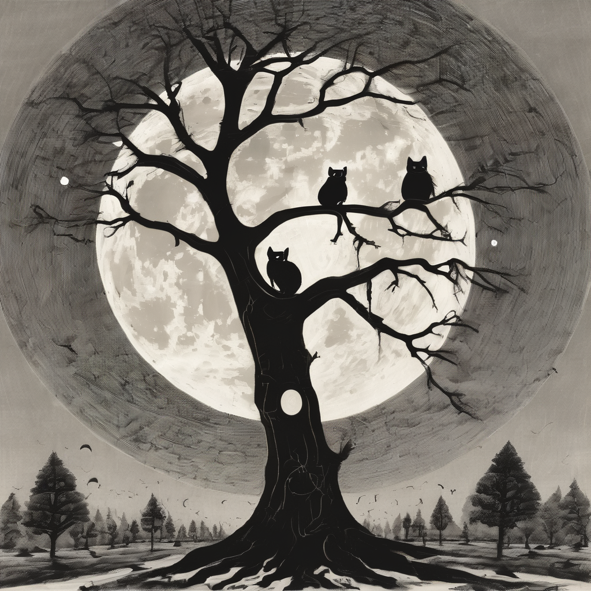

  

# supertrees – Rusty supervision trees

An experimental Rust crate that implements supervision trees in the spirit of
[Erlang/OTP](https://www.erlang.org/doc/design_principles/des_princ).

For details, please refer to the [documentation](https://docs.rs/supertrees).
